## 📊 Performance Profiling Report

### 📝 App Performance Overview

Before applying any optimizations, the performance of the application was analyzed using **React DevTools Profiler**. The following interactive tasks were evaluated:

- 🔍 **Searching countries** by partial name match
- 🌍 **Filtering countries** by region
- 🔢 **Sorting countries** by population and name
- 🔄 **Resetting all filters**

After the analysis, I implemented several optimizations to improve performance:

- 🧩 **React.memo** to prevent unnecessary re-renders of functional components
- 🔍 **useMemo** to memoize expensive calculations
- 🔄 **useCallback** to memoize callbacks and prevent unnecessary re-renders
- 🔧 Improved **props** to ensure only relevant data is passed to components
- 🌳 Optimized the **location of components** in the virtual DOM tree to reduce unnecessary re-renders and improve rendering efficiency

These tasks were analyzed to assess the app's responsiveness and identify potential performance improvements.

---

### 🔍 The App Performance Before Optimizations

**📷 React Profiler (Before Optimization):**  

### 📈 Key Findings (Before Optimization)

| Commit Duration | Render Duration   `<CountriesTable/>` | Interactions                                 | Flame Graph                                               | Ranked Chart                                                |
|-----------------|-------------------------------------------|----------------------------------------------|-----------------------------------------------------------|-------------------------------------------------------------|
| **3.1ms**       | **0.9ms**                                 | Searching for countries containing _"land"_  | 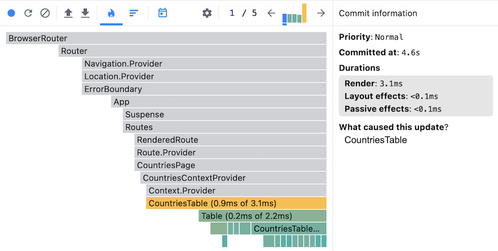 | 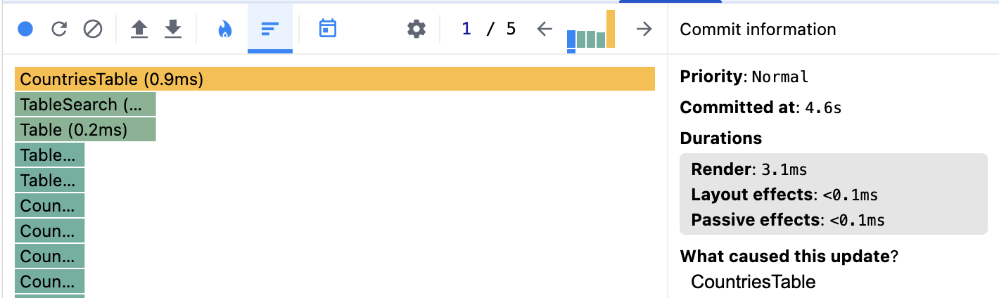 |
| **2.7ms**       | **0.9ms**                                 | Filtering by region _"Europe"_ | 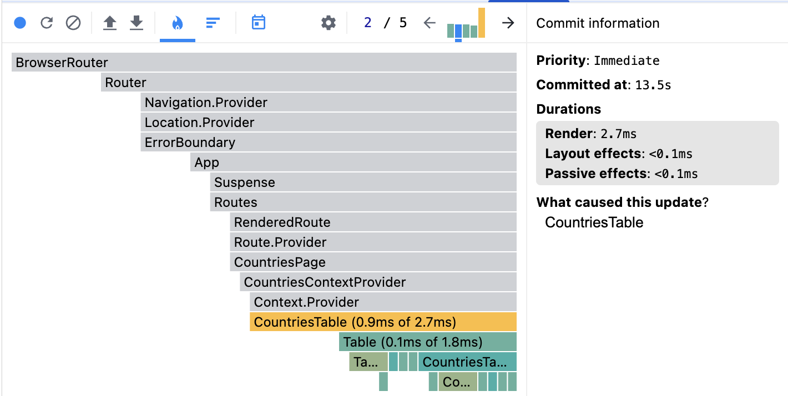 | 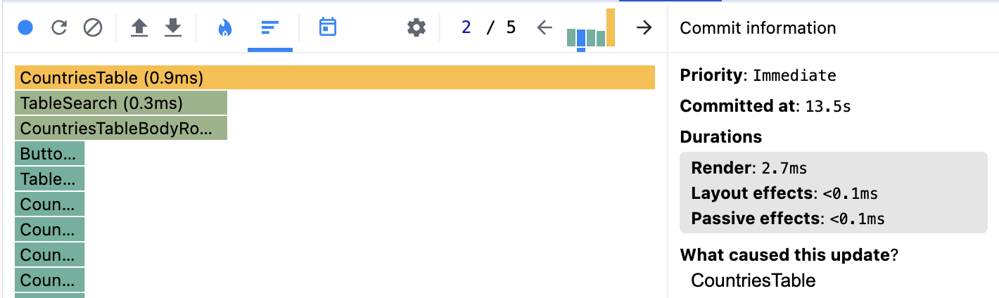 |
| **2.7ms**       | **0.9ms**                                 | Sorting by population _(descending)_         | 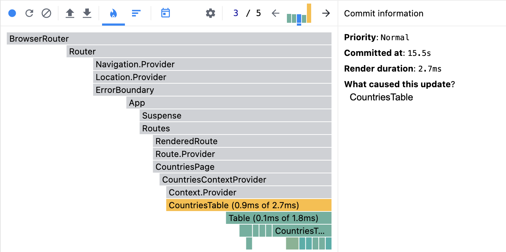 | 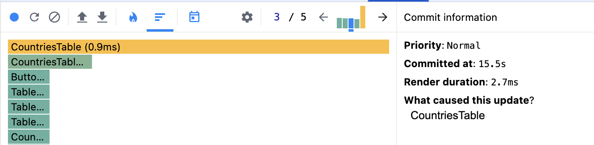 |
| **2.2ms**       | **0.6ms**                                 | Sorting by country _(ascending)_             | 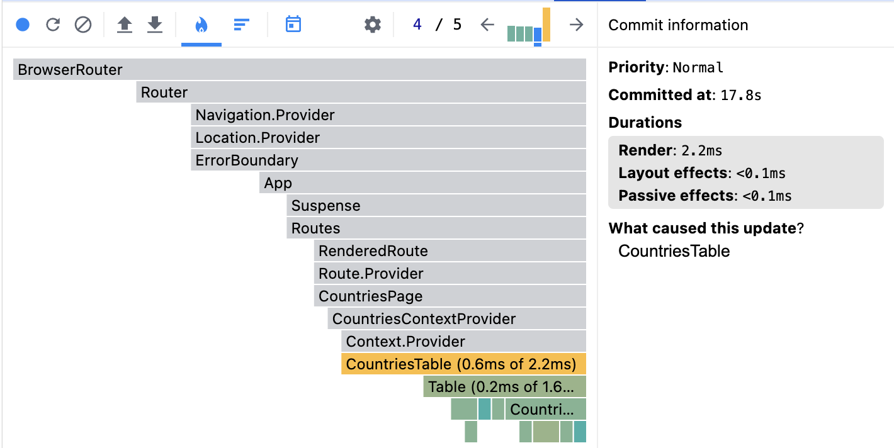 | 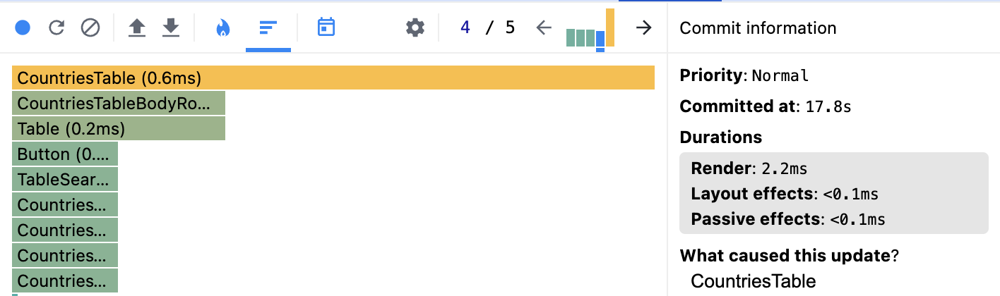 |
| **32.4ms**      | **1.5ms**                                 | Resetting all filters                        | 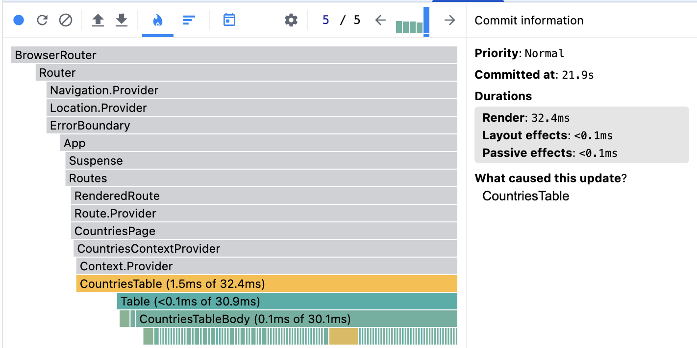 | 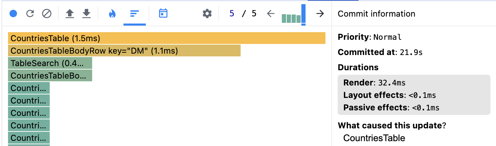 |

---

### 🔍 The App Performance After Optimizations

**📷 React Profiler (After Optimization):**  
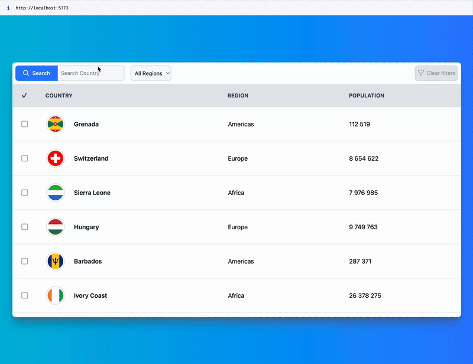

| Commit Duration                     | Render Duration   `<CountriesTable/>` | Interactions                                | Flame Graph                                              | Ranked Chart                                               |
| ----------------------------------- | ----------------------------------------- | ------------------------------------------- | -------------------------------------------------------- | ---------------------------------------------------------- |
| **3.1ms → 3ms   🔽 3%**         | **0.9ms → 0.6ms   🔽 33%**            | Searching for countries containing _"land"_ | 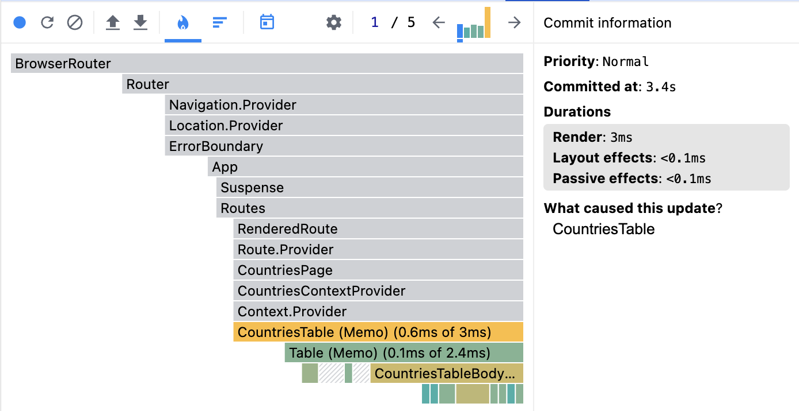 | 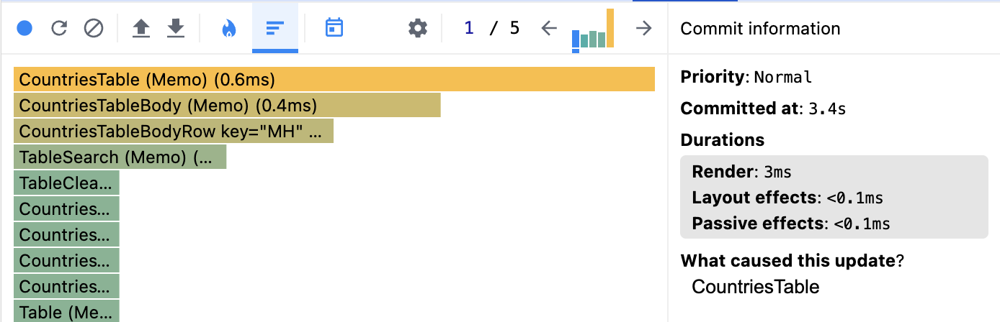 |
| **2.7ms → 1.2ms   🔽 55%**      | **0.9ms → 0.2ms   🔽 77%**            | Filtering by region _"Europe"_              | 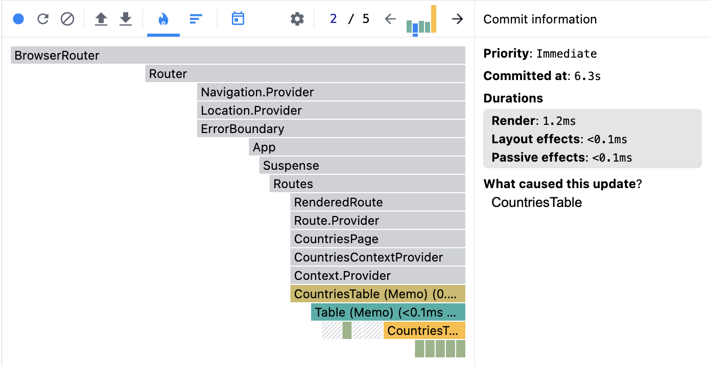 |  |
| **2.7ms → 2.5ms   🔽 7%**       | **0.9ms → 0.4ms   🔽 55%**            | Sorting by population _(descending)_        | 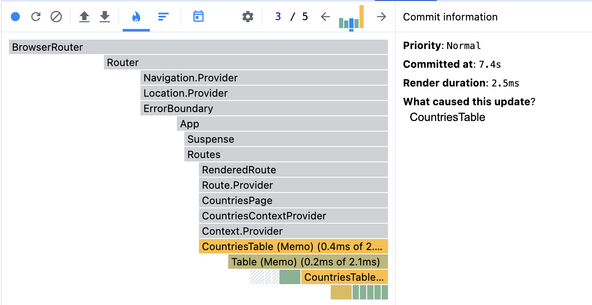 | 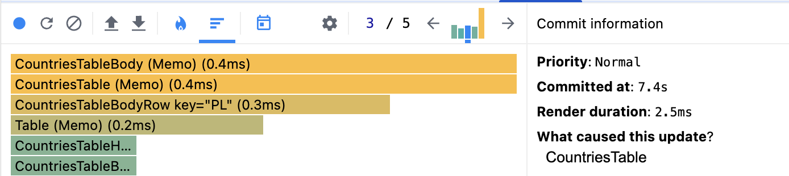 |
| **2.2ms → 2ms   🔽 9%**         | **0.6ms → 0.3ms   🔽 50%**            | Sorting by country _(ascending)_            | 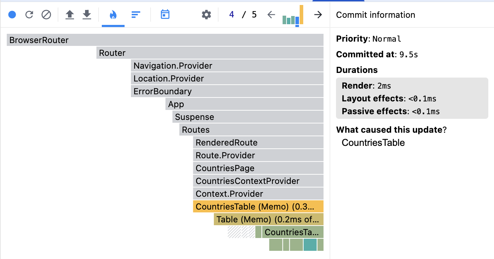 | 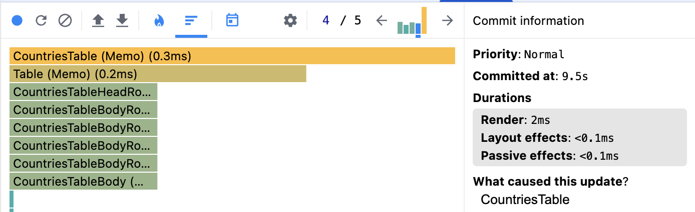 |
| **32.4ms → 32.7ms   ⚖️ Stable** | **1.5ms → 1ms   🔽 33%**              | Resetting all filters                       | 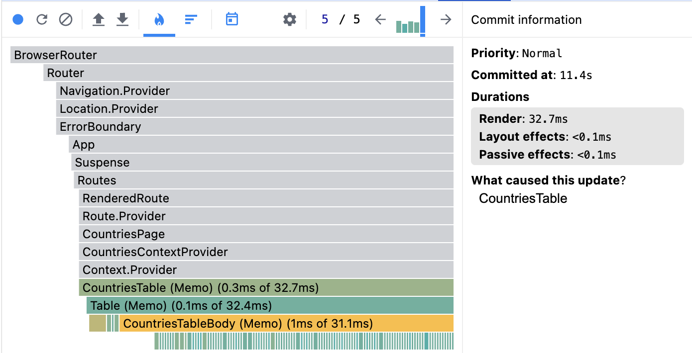 |  |

---

### 📌 Summary

✅ **Achieved Performance Gains:**

- 🚀 **Rendering efficiency improved by ~50% overall** across common interactions.
- 🚀 **Filtering & sorting operations are significantly faster**, especially filtering by region **(77% speedup)**.
- ⚖️ **Resetting filters remained stable**, with no meaningful performance regression.
- 🔹 **Unnecessary re-renders prevented**, components now update only when necessary, thanks to precise memoization with specific props. **See 📷 React Profiler**: Before vs. After.
- 🌳 **Optimized the location of components** in the virtual DOM tree to reduce unnecessary re-renders and improve rendering efficiency. **See 📷 React Profiler**: Before vs. After.
